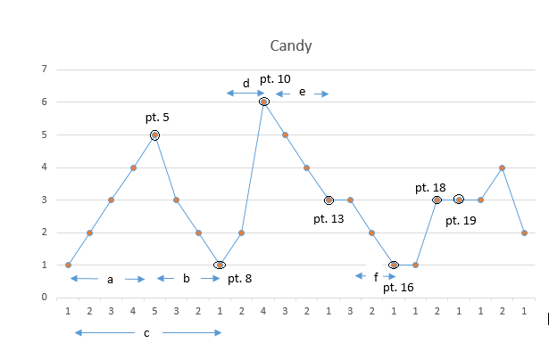

135. Candy

There are *N* children standing in a line. Each child is assigned a rating value.

You are giving candies to these children subjected to the following requirements:

- Each child must have at least one candy.
- Children with a higher rating get more candies than their neighbors.

What is the minimum candies you must give?

**Example 1:**

```
Input: [1,0,2]
Output: 5
Explanation: You can allocate to the first, second and third child with 2, 1, 2 candies respectively.
```

**Example 2:**

```
Input: [1,2,2]
Output: 4
Explanation: You can allocate to the first, second and third child with 1, 2, 1 candies respectively.
             The third child gets 1 candy because it satisfies the above two conditions.
```

**解法1**	暴力求解

不断循环，调整分配，直到收敛

*java不超时，cpp出现超时。。。*

```java
public class Solution {
    public int candy(int[] ratings) {
        int[] candies = new int[ratings.length];
        Arrays.fill(candies, 1);
        boolean flag = true;
        int sum = 0;
        while (flag) {
            flag = false;
            for (int i = 0; i < ratings.length; i++) {
                if (i != ratings.length - 1 && ratings[i] > ratings[i + 1] && candies[i] <= candies[i + 1]) {
                    candies[i] = candies[i + 1] + 1;
                    flag = true;
                }
                if (i > 0 && ratings[i] > ratings[i - 1] && candies[i] <= candies[i - 1]) {
                    candies[i] = candies[i - 1] + 1;
                    flag = true;
                }
            }
        }
        for (int candy : candies) {
            sum += candy;
        }
        return sum;
    }
}
```

**解法2**	使用两个数组l2r, r2l，分别表示与左边满足要求时的分配和与右边满足要求时的分配

从右往左扫描r2l：

if	ratings[i] > ratings[i-1] && r2l[i] <= r2l[i-1] : r2l[i] = r2l[i-1] + 1

从左往右扫描l2r：

if	ratings[i] > ratings[i+1] && r2l[i] <= r2l[i+1] : r2l[i] = r2l[i+1] + 1

最终$res = \sum_{i=0}^{n-1} \max\{l2r[i], r2l[i]\}$

```c++
class Solution {
public:
    int candy(vector<int>& ratings) {
        int n = ratings.size();
        if(n == 1) return 1;
        
        vector<int>l2r(n, 1), r2l(n, 1);
        for(int i = 1; i < n; ++i){
            if(ratings[i] > ratings[i-1])l2r[i] = l2r[i-1] + 1;
        }
        for(int i = n-2; i >= 0; --i){
            if(ratings[i] > ratings[i+1])r2l[i] = r2l[i+1] + 1;
        }
        int res = 0;
        for(int i = 0; i < n; ++i)res += max(l2r[i], r2l[i]);
        return res;
    }
};
```

**解法3**

同解法2，优化为使用一个数组

```c++
class Solution {
public:
    int candy(vector<int>& ratings) {
        int n = ratings.size();
        vector<int>c(n, 1);
        for(int i = 1; i < n; ++i){
            if(ratings[i] > ratings[i-1] && c[i] <= c[i-1]){
                c[i] = c[i-1]+1;
            }
        }
        for(int i = n-2; i >= 0; --i){
            if(ratings[i] > ratings[i+1] && c[i] <= c[i+1]){
                c[i] = c[i+1]+1;
            }
        }
        int res = 0;
        for(int x : c)res += x;
        return res;
    }
};
```

**解法4**	使用常数空间复杂度

出发点：在上坡部分的分配是$1,2,...,n$，下坡的分配是$m, ..., 2, 1$形式，局部的最优分配可以根据评分的分布直接计算



pt5是第一个波峰，pt8是第一座山的结束，在pt8时计算区域c的糖果数。上升区域4步，下降3步，因此pt5归属上升侧

$candy1 = \frac{(4+1)*4}{2} + \frac{(3 + 1)*3}{2} + \max(4, 3) + 1$

pt10是第二个波峰，上升2下降3, pt8多计算一次

$candy2 = \frac{(2+1)*2}{2}+\frac{(3+1)*3}{2}+\max(2,3)+1$

pt13到pt16是第三个，上升0，下降2, pt13多计算一次

$candy3 = \frac{(0+1)*0}{2}+\frac{(2+1)*2}{2}+\max(0,2)+1$

。。。