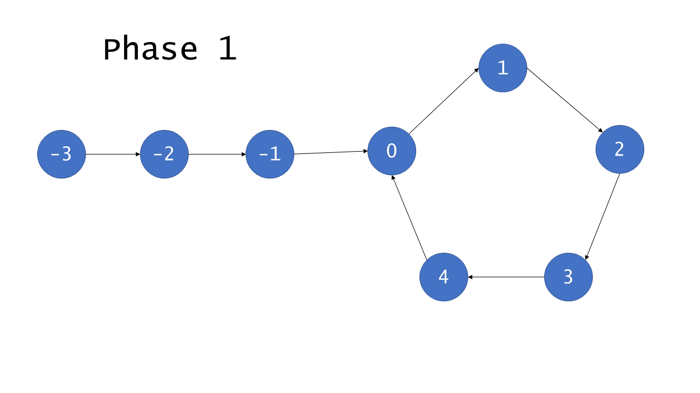

142. Linked List Cycle II

Given a linked list, return the node where the cycle begins. If there is no cycle, return `null`.

To represent a cycle in the given linked list, we use an integer `pos` which represents the position (0-indexed) in the linked list where tail connects to. If `pos` is `-1`, then there is no cycle in the linked list.

**Note:** Do not modify the linked list.

 

**Example 1:**

```
Input: head = [3,2,0,-4], pos = 1
Output: tail connects to node index 1
Explanation: There is a cycle in the linked list, where tail connects to the second node.
```


**Example 2:**

```
Input: head = [1,2], pos = 0
Output: tail connects to node index 0
Explanation: There is a cycle in the linked list, where tail connects to the first node.
```


**Example 3:**

```
Input: head = [1], pos = -1
Output: no cycle
Explanation: There is no cycle in the linked list.
```


 

**Follow-up**:
Can you solve it without using extra space?

**解法1**	hashset

```c++
/**
 * Definition for singly-linked list.
 * struct ListNode {
 *     int val;
 *     ListNode *next;
 *     ListNode(int x) : val(x), next(NULL) {}
 * };
 */
class Solution {
public:
    ListNode *detectCycle(ListNode *head) {
        unordered_map<ListNode*, bool>hash;
        ListNode* p = head;
        while(p){
            if(hash[p])return p;
            hash[p] = true;
            p = p->next;
        }
        return NULL;
    }
};
```

**解法2**	双指针。

第一阶段：检测环是否存在



无环部分编号为-F, ..., -1，有环部分编号为0, 1, 2, ..., C - 1

快指针为pp, 慢指针为p，当指针p到达节点0时，快指针到达h$(F\equiv h(\mod C))$

第二阶段：寻找0号节点


根据$2\times d(p) = d(pp)$可知：
$$
2\times (F+a) = F+a+b+a\Longrightarrow F = b
$$

```c++
class Solution {
public:
    ListNode *detectCycle(ListNode *head) {
        if(head == NULL || head->next == NULL)return NULL;
        ListNode* p = head->next, *pp = head->next->next;
        while(p != pp){
            if(p == NULL || pp == NULL || pp->next == NULL)return NULL;
            p = p->next;
            pp = pp->next->next;
        }
        pp = head;
        while(pp != p){
            pp = pp->next;
            p = p->next;
        }
        return p;
    }
};
```

