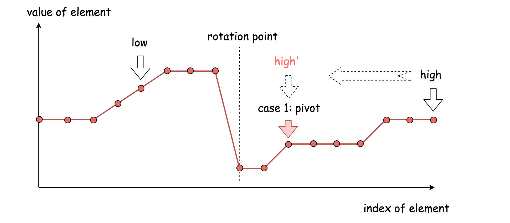
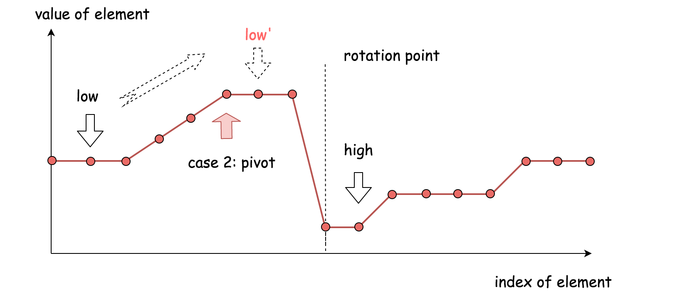
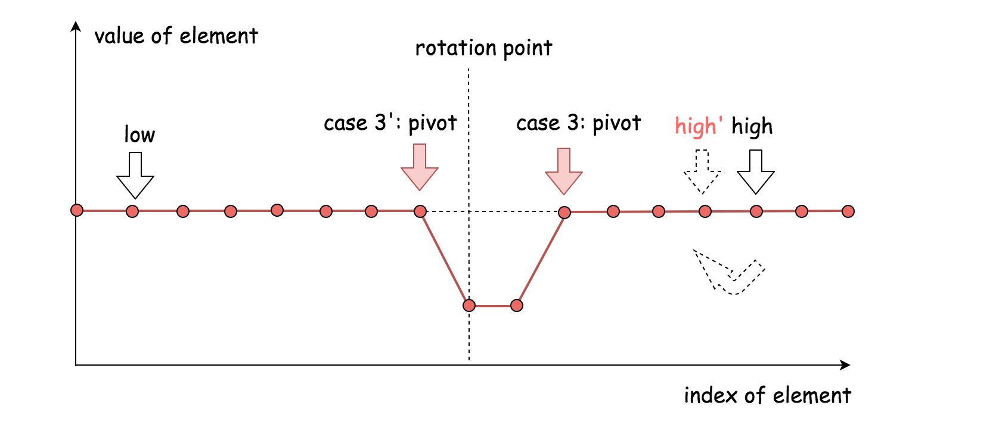

154. Find Minimum in Rotated Sorted Array II

Suppose an array sorted in ascending order is rotated at some pivot unknown to you beforehand.

(i.e.,  `[0,1,2,4,5,6,7]` might become  `[4,5,6,7,0,1,2]`).

Find the minimum element.

The array may contain duplicates.

**Example 1:**

```
Input: [1,3,5]
Output: 1
```

**Example 2:**

```
Input: [2,2,2,0,1]
Output: 0
```

**Note:**

- This is a follow up problem to [Find Minimum in Rotated Sorted Array](https://leetcode.com/problems/find-minimum-in-rotated-sorted-array/description/).
- Would allow duplicates affect the run-time complexity? How and why?

**解**    三种情况







```c++
class Solution {
public:
    int findMin(vector<int>& nums) {
        if(nums.size() == 1)return nums[0];
        int l = 0, r = nums.size()-1, mid;
        if(nums[r] > nums[l])return nums[l];
        while(l < r){
            mid = (l+r)/2;
            if(nums[mid] > nums[r])l = mid+1;
            else if(nums[mid] < nums[r])r = mid;
            else r = r - 1;
        }
        return nums[l];
    }
};
```

