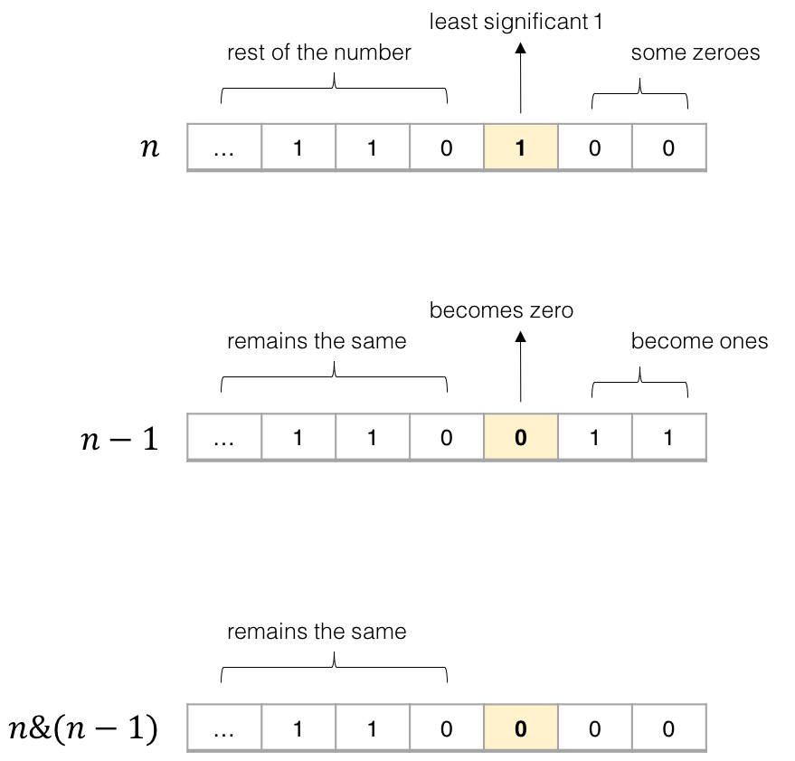

191. Number of 1 Bits

Write a function that takes an unsigned integer and return the number of '1' bits it has (also known as the [Hamming weight](http://en.wikipedia.org/wiki/Hamming_weight)).

**Example 1:**

```
Input: 00000000000000000000000000001011
Output: 3
Explanation: The input binary string 00000000000000000000000000001011 has a total of three '1' bits.
```

**Example 2:**

```
Input: 00000000000000000000000010000000
Output: 1
Explanation: The input binary string 00000000000000000000000010000000 has a total of one '1' bit.
```

**Example 3:**

```
Input: 11111111111111111111111111111101
Output: 31
Explanation: The input binary string 11111111111111111111111111111101 has a total of thirty one '1' bits.
```

 

**Note:**

- Note that in some languages such as Java, there is no unsigned integer type. In this case, the input will be given as signed integer type and should not affect your implementation, as the internal binary representation of the integer is the same whether it is signed or unsigned.
- In Java, the compiler represents the signed integers using [2's complement notation](https://en.wikipedia.org/wiki/Two's_complement). Therefore, in **Example 3** above the input represents the signed integer `-3`.


 **解1**	移位+统计1的个数。每次看n的最后一位是不是1，然后右移一位，直到n==0成立

```c++
class Solution {
public:
    int hammingWeight(uint32_t n) {
        int res = 0;
        while(n){
            if(n & 1 == 1)res++;
            n >>= 1;
        }
        return res;
    }
};
```

**解2**	将n中的1全部翻转。n&(n-1)会使n翻转最后一个1



```c++
class Solution {
public:
    int hammingWeight(uint32_t n) {
        int res = 0;
        while(n){
            res++;
            n &= n - 1;
        }
        return res;
    }
};
```

