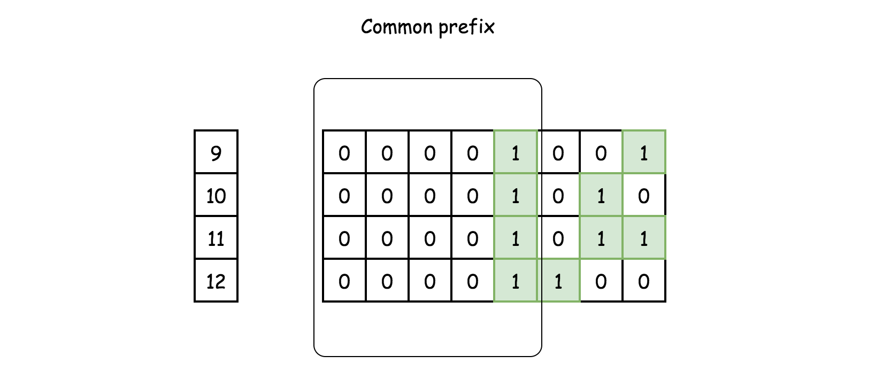

201. Bitwise AND of Numbers Range

Given a range [m, n] where 0 <= m <= n <= 2147483647, return the bitwise AND of all numbers in this range, inclusive.

**Example 1:**

```
Input: [5,7]
Output: 4
```

**Example 2:**

```
Input: [0,1]
Output: 0
```

**解法1**	一个一个做位与，但是会超时。。。

**解法2**	事实：

+ 与运算中，只要有一个是0，结果肯定是0
+ 将二进制数字看作是字符串时，m和n的共同前缀也是范围[m, n]中所有数字的共同前缀



因此只需要求出m和n的共同前缀即可

**解法2.1**	移位。将m和n逐一向右移位，直到两者相等

```c++
class Solution {
public:
    int rangeBitwiseAnd(int m, int n) {
        int shift = 0;
        while(m != n){
            m >>= 1;
            n >>= 1;
            shift++;
        }
        return  m << shift;
    }
};
```

**解法2.2**	Brian Kernighan's Algorithm。n&(n-1)会将n中最右边的1翻转为0

```c++
class Solution {
public:
    int rangeBitwiseAnd(int m, int n) {
        while(m < n)n &= n - 1;
        return m & n;
    }
};
```

