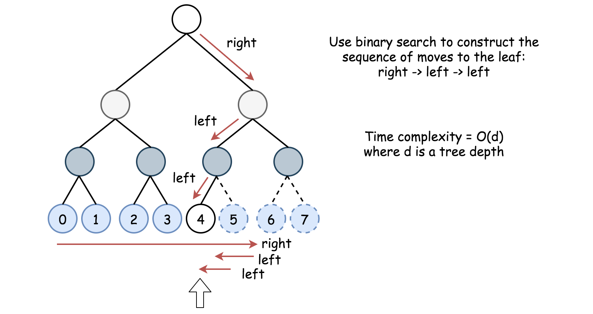

222. Count Complete Tree Nodes

Given a **complete** binary tree, count the number of nodes.

**Note:**

**Definition of a complete binary tree from [Wikipedia](http://en.wikipedia.org/wiki/Binary_tree#Types_of_binary_trees):**
In a complete binary tree every level, except possibly the last, is completely filled, and all nodes in the last level are as far left as possible. It can have between 1 and 2h nodes inclusive at the last level h.

**Example:**

```
Input: 
    1
   / \
  2   3
 / \  /
4  5 6

Output: 6
```

**解法1**	一般的计算节点数目方法，count(root) = 1 + count(root->left) + count(root->left)

```c++
class Solution {
public:
    int countNodes(TreeNode* root) {
        if(root == NULL)return 0;
        return 1 + countNodes(root->left) + countNodes(root->right);
    }
}
```

**解法2**	先序/中序/后序遍历一次

```c++
class Solution {
public:
    int countNodes(TreeNode* root) {
        int ans = 0;
        pre(root, ans);
        return ans;
    }
    void pre(TreeNode *root, int &ans){
        if(root == NULL)return;
        ans++;
        pre(root->left, ans);
        pre(root->right, ans);
    }
};
```

**解法3**	考虑到完全二叉树的特点：对于每一个节点来说，总有一边是满二叉树，高度为$d$满二叉树共有$2^d-1$个节点

```c++
class Solution {
public:
    int countNodes(TreeNode* root) {
        int l_h = get_left_h(root);
        int r_h = get_right_h(root);
        if(l_h == r_h)return pow(2, l_h) - 1;
        return 1 + countNodes(root->left) + countNodes(root->right);
    }
    int get_left_h(TreeNode *root){
        int d = 0;
        while(root){
            d++;
            root = root->left;
        }
        return d;
    }
    int get_right_h(TreeNode *root){
        int d = 0;
        while(root){
            d++;
            root = root->right;
        }
        return d;
    }
};
```

**解法4**	考虑完全二叉树的特点：只有最后一层是不满的，采用二分查找确定是从哪里分割的，即寻找第一个没有出现在叶子节点中的节点编号

+ 如何判断一个叶子节点是否存在

  将叶子节点编号为$[0, 1, ..., 2^d -1]$，根节点将叶子节点分成了$[0, \frac{2^d-1}{2}-1]$和$[\frac{2^d-1}{2}, 2^d-1]$两部分，查找编号为idx的叶子时：

  + idx <= mid, root = root->left
  + idx > mid, root = root->right



+ 如何查找第一个不存在的叶子结点的编号

  假设第一个不存在的叶子结点在区间$[l, r]$中，判断中点$mid = (l + r) / 2$

  + exist(mid) == true ：中点及左侧区间被排除
  + exist(mid) == false : 右侧区间被排除

```c++
class Solution {
public:
    int countNodes(TreeNode* root) {
        int l_h = get_left_h(root);
        int r_h = get_right_h(root);
        if(l_h == r_h)return pow(2, r_h) - 1;
        int l = 0, r = pow(2, r_h) - 1;
        while(l < r){
            int mid = (l + r) / 2;
            if(exist(mid, r_h, root)){
                l = mid + 1;
            }else{
                r = mid;
            }
        }
        return pow(2, r_h) + l-1;
    }
    bool exist(int val, int d, TreeNode *root){
        int l = 0, r = pow(2, d)-1;
        TreeNode *cur = root;
        for(int i = 0; i < d; ++i){
            int mid = (l + r) / 2;
            if(val <= mid){
                r = mid;
                cur = cur->left;
            }else{
                l = mid + 1;
                cur = cur->right;
            }
        }
        return cur != NULL;
    }
    int get_left_h(TreeNode *root){
        int d = 0;
        while(root){
            d++;
            root = root->left;
        }
        return d;
    }
    int get_right_h(TreeNode *root){
        int d = 0;
        while(root){
            d++;
            root = root->right;
        }
        return d;
    }
};
```

